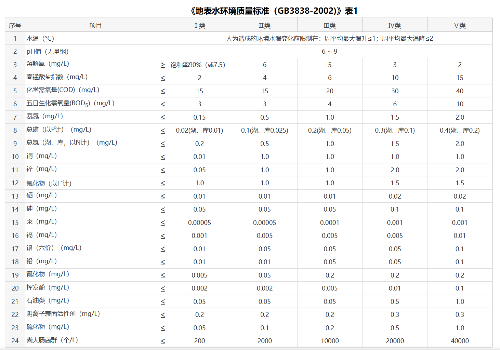

# 水质数据
水质数据来自中国环境检测总站，发布指标为水温、pH、溶解氧、电导率、浊度、高猛酸盐指数、氨氮、总磷、总氮共九项监测指标。
水质评价指标：地表水水质评价指标为《地表水环境质量标准(GB3838-2002)》表1中除水温、总氮、类大肠菌群以外的21项指标。国控水站水质评价指标为
pH、溶解氧、高锰酸盐指数、氨氮、总磷5项指标。
**异常数据可以自行设置。**

# 鱼类数据
Fish.csv文件包含种类、体重、体长、高度（背部到腹部的垂直距离，不常用）和宽度（鱼体中段的最大宽度）五种信息。

鱼类图像、视频等数据可到[Fish4Knowledge Homepage](https://homepages.inf.ed.ac.uk/rbf/fish4knowledge/)自行下载

# 传感器数据
传感器相关数据请大家自己寻找或生成，不一定要具体的设备编号，可以以“设备一”，“设备二”代称。

# 视频数据

视频请大家自行寻找，任意视频均可。